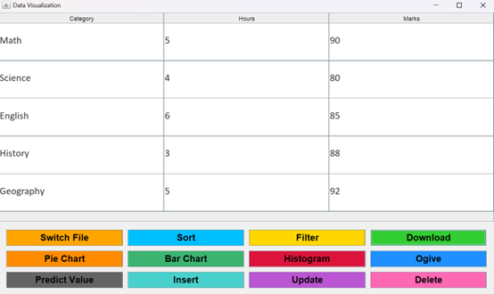
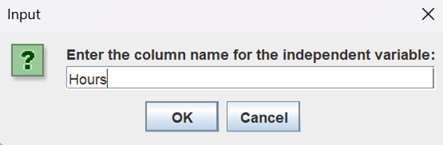
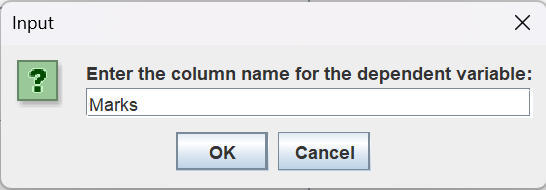
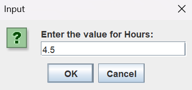
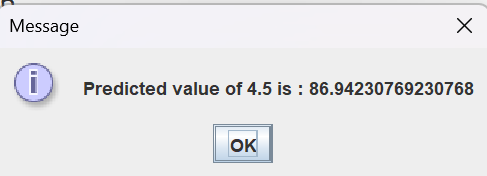
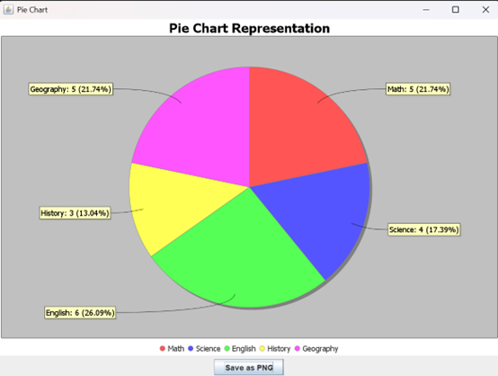

# Excel Data Analysis and Visualization System

A comprehensive desktop application for importing, analyzing, and visualizing Excel data with interactive charts and predictive analytics. Built with Java Swing and MySQL, this system provides an intuitive platform for data-driven decision-making.


## Admin Dashboard



## Prediction Results









## Pie Chart

## 🎯 Features

### Data Import & Management
- **Dynamic Excel File Import** – Select and import any Excel file (.xlsx) with automatic schema detection
- **Flexible Column Handling** – Intelligently detects and handles empty columns
- **Database Integration** – Seamless MySQL integration for data persistence
- **File Switching** – Switch between different Excel files without restarting
- **Automated Cleanup** – Auto-clear old data when importing new files or exiting

### Data Visualization
- **Pie Charts** – Display categorical distribution with percentage labels
- **Bar Charts** – Compare multiple categories side-by-side
- **Histograms** – Visualize frequency distributions of continuous data
- **Ogive Charts** – Show cumulative frequency curves with annotations
- **PNG Export** – Save charts as image files for reports and presentations

### Data Analysis & Operations
- **Insert** – Add new records to the database
- **Update** – Modify existing data entries
- **Delete** – Remove records with confirmation
- **Filter** – Apply multi-criteria filters with min/max value ranges
- **Sort** – Arrange data in ascending or descending order
- **Download** – Export filtered/full data to Excel (.xlsx)

### Predictive Analytics
- **Linear Regression** – Predict dependent variables based on independent variables
- **Trend Analysis** – Identify patterns in historical data
- **Forecast Future Values** – Estimate outcomes based on regression models
- **Interactive Predictions** – Real-time prediction with user-defined inputs

### Security & Access Control
- **Secure Login** – Password-protected authentication dialog
- **Session Management** – Track user login state
- **Role-Based Access** – Different permission levels for admin and regular users
- **Input Sanitization** – Parameterized queries prevent SQL injection

## 🛠 Technology Stack

| Component | Technology |
|-----------|-----------|
| **Frontend** | Java Swing GUI |
| **Backend** | MySQL 5.7+ |
| **Database** | JDBC (Java Database Connectivity) |
| **Charting** | JFreeChart 1.5.0+ |
| **Excel Handling** | Apache POI 5.0+ |
| **Build Tool** | Maven (optional) |
| **Platform** | Windows/Linux/macOS |

## 📋 System Requirements

### Hardware
- **Processor**: Intel Core i3 or equivalent (2.0 GHz)
- **RAM**: 4 GB minimum
- **Hard Disk**: 128 GB (OS + Application)
- **Display**: 1366×768 resolution minimum

### Software
- **Java**: JRE 8 or higher (JDK 11+ recommended)
- **MySQL**: 5.7 or higher
- **Operating System**: Windows 7+, macOS 10.13+, Ubuntu 18.04+

### Libraries
```xml
<!-- Core Libraries -->
- mysql-connector-java 8.0+
- jfree-chart 1.5.0+
- apache-poi 5.0+
```

## 🚀 Installation & Setup

### 1. Prerequisites
```bash
# Check Java installation
java -version

# Check MySQL installation
mysql --version
```

### 2. Database Setup
```bash
# Connect to MySQL
mysql -u root -p

# Create database
CREATE DATABASE Major;
USE Major;

# Create table
CREATE TABLE Major (
    CategoryNames VARCHAR(255) PRIMARY KEY,
    Category1 INT NOT NULL,
    Category2 INT
);
```

### 3. Configure Database Connection
Edit the connection parameters in `DataVisualizationGUI.java`:
```java
public String jdbcURL = "jdbc:mysql://localhost:3306/major";
public String username = "root";
public String password = "your_password";
```

### 4. Compile & Run
```bash
# Compile all Java files
javac -cp .:lib/* src/com/example/*.java

# Run the application
java -cp .:lib/* com.example.DataVisualizationGUI
```

### 5. Login Credentials
```
Default Credentials:
Username: admin
Password: password
```

## 💻 Usage Guide

### Starting the Application
1. Run the application using the command above
2. Enter login credentials on the login dialog
3. Select an Excel file when prompted
4. Data is automatically imported and displayed

### Importing Excel Files
1. On startup or click "Switch File"
2. Choose .xlsx file from file browser
3. System automatically:
   - Detects column headers
   - Validates data types
   - Handles empty columns
   - Loads data into MySQL
   - Displays in table view

### Creating Visualizations

#### Pie Chart
1. Click "Pie Chart" button
2. Enter column name (e.g., "CategoryNames")
3. Chart displays with percentages
4. Click "Save as PNG" to export

#### Bar Chart
1. Click "Bar Chart" button
2. System automatically compares all numeric columns
3. Save chart as PNG file

#### Histogram
1. Click "Histogram" button
2. Enter column name for frequency distribution
3. System validates data continuity
4. Displays frequency distribution

#### Ogive Chart
1. Click "Ogive" button
2. Select column for cumulative frequency
3. Chart shows cumulative trend with annotations
4. Export to PNG

### Data Operations

#### Insert New Record
1. Click "Insert" button
2. Enter: Category Name, Value1, Value2
3. Click OK to save to database
4. Table refreshes automatically

#### Update Record
1. Click "Update" button
2. Enter category name to modify
3. Enter new values
4. Database updates and table refreshes

#### Delete Record
1. Click "Delete" button
2. Enter category name to remove
3. Record is deleted from database
4. Table refreshes

#### Filter Data
1. Click "Filter" button
2. Enter column name (e.g., "Category1")
3. Specify min and max values
4. View filtered results
5. Save filtered data as Excel

#### Sort Data
1. Click "Sort" button
2. Enter column name
3. Select ASC or DESC order
4. View sorted results
5. Export to Excel if needed

### Making Predictions
1. Click "Predict Value" button
2. Enter independent variable (X-axis column)
3. Enter dependent variable (Y-axis column)
4. Enter X value to predict
5. System calculates Y using linear regression
6. Result displayed in dialog

## 📊 Database Schema

### Table: Major
```sql
CREATE TABLE Major (
    CategoryNames VARCHAR(255) NOT NULL PRIMARY KEY,
    Category1 INT NOT NULL,
    Category2 INT
);
```

### Column Descriptions
- **CategoryNames** – Unique category identifier (Text)
- **Category1** – First numeric attribute (Integer)
- **Category2** – Optional second numeric attribute (Integer, nullable)

## 🔐 Security Implementation

### Authentication
- Login dialog with username/password validation
- Session-based access control
- Failed login attempts show error messages

### Data Protection
- **SQL Injection Prevention** – Uses PreparedStatements
- **Parameterized Queries** – User inputs safely bound to SQL
- **Input Validation** – Column names and values checked before execution
- **Password Fields** – JPasswordField masks input for security

### Best Practices
1. Never store passwords in plain text
2. Use parameterized queries for all database operations
3. Validate user input before database operations
4. Implement role-based access control
5. Clear session data on application exit

## 📈 Predictive Analytics Algorithm

### Linear Regression Formula
```
Given data points (x₁, y₁), (x₂, y₂), ..., (xₙ, yₙ)

Slope (β₁) = (n*Σ(xy) - Σx*Σy) / (n*Σ(x²) - (Σx)²)
Intercept (β₀) = (Σy - β₁*Σx) / n

Prediction: y = β₀ + β₁*x
```

### Example
```
Data: English vs Maths scores
Input: English = 75
Predicted Maths = intercept + (slope * 75)
```

## 🧪 Testing

### Unit Testing Scenarios
- ✅ Insert new records
- ✅ Update existing records
- ✅ Delete records
- ✅ Filter with various criteria
- ✅ Sort in ASC/DESC order
- ✅ Chart generation and export
- ✅ Prediction calculations
- ✅ File switching and data reload

### Integration Testing
- ✅ Database connectivity
- ✅ CRUD operations with database
- ✅ Chart data retrieval
- ✅ Excel import/export workflow
- ✅ Concurrent user operations

### GUI Testing
- ✅ Login dialog functionality
- ✅ Button responsiveness
- ✅ Error message displays
- ✅ Table data accuracy
- ✅ File chooser operations
- ✅ Chart rendering quality

## 📁 Project Structure

```
excel-data-analysis/
├── src/
│   └── com/example/
│       └── DataVisualizationGUI.java    # Main application class
├── lib/
│   ├── mysql-connector-java-8.0.jar
│   ├── jfreechart-1.5.0.jar
│   ├── jcommon-1.0.24.jar
│   └── poi-5.0.0.jar
├── database/
│   └── schema.sql                        # Database initialization script
├── README.md
└── LICENSE
```

## 🎨 User Interface

### Main Window
- **Top**: Scrollable table displaying imported data
- **Bottom**: 12 color-coded buttons for operations
  - Orange: Pie Chart
  - Green: Bar Chart
  - Red: Histogram
  - Blue: Ogive
  - Turquoise: Insert
  - Purple: Update
  - Gold: Filter
  - Pink: Delete
  - Sky Blue: Sort
  - Lime: Download
  - Teal: Switch File
  - Gray: Predict Value

### Dialog Windows
- **Login**: Secure authentication interface
- **Insert/Update/Delete**: Data entry forms
- **Filter**: Multi-criteria filter panel
- **Chart**: Full-size chart visualization with save option
- **File Chooser**: Browse and select Excel files

## ⚠️ Limitations

1. **Scalability** – Performance may degrade with datasets > 100,000 rows
2. **Offline Mode** – Requires continuous database connectivity
3. **Concurrent Users** – Single-user application (not multi-user)
4. **Advanced ML** – Basic linear regression only (no complex models)
5. **Chart Customization** – Limited chart styling options
6. **Data Validation** – Minimal input validation before insertion

## 🔮 Future Enhancements

- [ ] Cloud database integration (AWS, Azure)
- [ ] Real-time collaboration support
- [ ] Advanced ML models (ARIMA, Prophet)
- [ ] Multi-language support (i18n)
- [ ] Drag-and-drop file upload
- [ ] Scheduled automated imports
- [ ] Custom report templates
- [ ] Dashboard view with KPIs
- [ ] User role management system
- [ ] Data encryption at rest
- [ ] Undo/Redo functionality
- [ ] Batch processing operations

## 📚 References

- [MySQL Documentation](https://dev.mysql.com/doc/)
- [Java Swing Tutorials](https://docs.oracle.com/javase/tutorial/uiswing/)
- [JFreeChart User Guide](https://www.jfree.org/jfreechart/)
- [Apache POI Guide](https://poi.apache.org/)
- [JDBC Tutorial](https://docs.oracle.com/javase/tutorial/jdbc/)
- [Linear Regression Theory](https://en.wikipedia.org/wiki/Linear_regression)

#
## 👨‍💻 Author

**Dhruv Yadav**
- Student ID: 0221BCA095
- Program: Bachelor of Computer Applications (BCA)
- Institution: Bharati Vidyapeeth (Deemed to be University), New Delhi


---

**Last Updated**: April 23, 2025  
**Status**: Complete & Tested  
**Java Compatibility**: 8 - 21+
